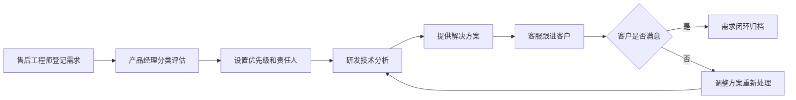

## 1. 产品概述

面向医疗器械售后团队的需求管理 Web 应用，用于整理医院客户提出的产品改进和服务要求，实现需求从收集、评估、研发到跟进的全流程管理。

- 核心目标：提升售后需求处理效率，确保客户反馈得到及时响应和闭环管理
- 目标用户：售后工程师、产品经理、研发人员、客服团队
- 市场价值：规范化需求管理流程，提升客户满意度，驱动产品持续优化

## 2. 核心功能

### 2.1 用户角色

| 角色 | 注册方式 | 核心权限 |
|------|----------|----------|
| 售后工程师 | 系统分配 | 登记需求、上传维修记录、跟进客户、查看台账 |
| 产品经理 | 系统分配 | 需求分类、优先级评估、分配责任部门、设置目标版本 |
| 研发人员 | 系统分配 | 查看需求、记录研发答复、可行性判断、提交替代方案 |
| 客服人员 | 系统分配 | 客户回访、同步进展、生成沟通纪要 |
| 管理员 | 系统分配 | 全部功能权限、用户管理、数据统计 |

### 2.2 功能模块

1. **汇总仪表盘**：高频设备统计、未响应需求、承诺到期事项、数据概览
2. **客户需求台账**：需求列表展示、多维度筛选、快速检索、新建需求
3. **需求详情**：需求完整信息展示、历史记录、关联维修记录
4. **优先级评估**：需求分类、影响程度评估、优先级设置、责任分配
5. **研发沟通**：研发答复记录、可行性判断、替代方案、版本计划
6. **客户跟进**：回访提醒、沟通记录、进展同步、纪要生成

### 2.3 页面详情

| 页面名称 | 模块名称 | 功能描述 |
|----------|----------|----------|
| 汇总仪表盘 | 数据概览卡片 | 展示需求总数、待处理数、已完成数、平均处理周期 |
| 汇总仪表盘 | 高频设备排行 | 柱状图展示问题最多的 Top 10 设备型号 |
| 汇总仪表盘 | 未响应需求列表 | 展示超过 48 小时未响应的需求，支持快速处理 |
| 汇总仪表盘 | 承诺到期提醒 | 展示即将到期和已逾期的承诺事项，红色预警 |
| 客户需求台账 | 筛选工具栏 | 按医院、科室、设备型号、状态、优先级多维度筛选 |
| 客户需求台账 | 需求列表 | 表格展示需求概要信息，支持排序和分页 |
| 客户需求台账 | 新建需求表单 | 录入医院信息、设备信息、问题描述、维修记录、照片等 |
| 需求详情 | 基础信息区 | 展示需求编号、医院、科室、设备、提交时间等 |
| 需求详情 | 问题描述区 | 展示问题详情、影响程度、客户期望、照片附件 |
| 需求详情 | 处理时间线 | 展示需求全流程处理记录，包括各节点时间和操作人 |
| 需求详情 | 维修记录关联 | 展示关联的维修工单历史 |
| 优先级评估 | 需求分类 | 区分故障修复、体验优化、合规要求、培训需求四类 |
| 优先级评估 | 评估维度 | 影响范围、紧急程度、修复难度、业务价值四维评分 |
| 优先级评估 | 责任分配 | 设置责任部门、责任人、目标版本、承诺完成时间 |
| 研发沟通 | 答复记录 | 记录研发人员的技术答复和解决方案 |
| 研发沟通 | 可行性分析 | 技术可行性判断、风险评估、工作量估算 |
| 研发沟通 | 替代方案 | 提供多种解决方案供选择和对比 |
| 客户跟进 | 回访计划 | 设置回访时间、回访方式、提醒配置 |
| 客户跟进 | 沟通记录 | 记录每次沟通内容、客户反馈、待办事项 |
| 客户跟进 | 进展同步 | 向客户同步最新处理进展，支持批量通知 |
| 客户跟进 | 纪要生成 | 自动生成标准化沟通纪要，支持导出 |

## 3. 核心流程

售后工程师在现场服务时发现问题或收到客户反馈，在系统中登记需求，上传维修记录和现场照片；产品经理对需求进行分类和优先级评估，分配给相应的研发部门；研发人员进行技术分析和可行性判断，提供解决方案并记录沟通内容；客服人员定期回访客户，同步处理进展，记录沟通内容直至需求闭环。

## 4. 用户界面设计

### 4.1 设计风格

- 主色调：医疗蓝 (#1E40AF)，代表专业和信任
- 辅助色：警示红 (#DC2626) 用于紧急和逾期提醒，成功绿 (#059669) 用于已完成状态
- 中性色：以 Slate 色系为基础，确保内容清晰可读
- 按钮风格：圆角 6px，悬停时有轻微阴影和颜色加深效果
- 字体：系统字体栈，标题使用中等字重，正文常规字重
- 布局风格：顶部导航 + 左侧菜单 + 内容区的经典后台布局，卡片式内容展示
- 图标风格：使用 Lucide 线性图标，保持简洁一致

### 4.2 页面设计概览

| 页面名称 | 模块名称 | UI 元素 |
|----------|----------|----------|
| 汇总仪表盘 | 数据概览 | 4 张统计卡片，数字动画效果，趋势小图表 |
| 汇总仪表盘 | 高频设备 | 水平柱状图，设备名称和数量标签 |
| 汇总仪表盘 | 预警列表 | 红色边框高亮逾期项，倒计时显示 |
| 客户需求台账 | 筛选栏 | 下拉选择器、日期范围、搜索框，紧凑排列 |
| 客户需求台账 | 数据表格 | 斑马纹行，悬停高亮，状态标签彩色区分 |
| 需求详情 | 时间线 | 垂直时间线，节点图标区分操作类型 |
| 优先级评估 | 评分面板 | 滑块或星级评分，实时计算综合优先级 |
| 客户跟进 | 沟通记录 | 聊天气泡样式，区分内部记录和客户沟通 |

### 4.3 响应式

- 采用桌面优先设计，主内容区最小宽度 1200px
- 侧边栏支持折叠，适配不同屏幕尺寸
- 表格在小屏幕下转为卡片列表展示
- 触摸设备优化按钮尺寸和点击区域

### 4.4 交互细节

- 页面加载时采用淡入动画，内容区域依次出现
- 表格行悬停时有背景色变化和轻微上浮效果
- 状态变更时有颜色过渡动画
- 表单输入聚焦时有边框高亮和轻微阴影
- 模态框采用缩放进入动画，背景半透明遮罩
