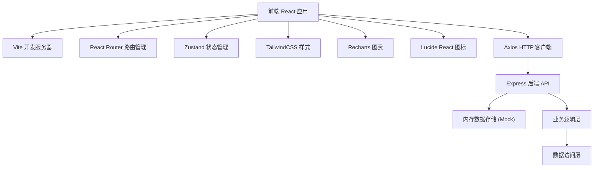
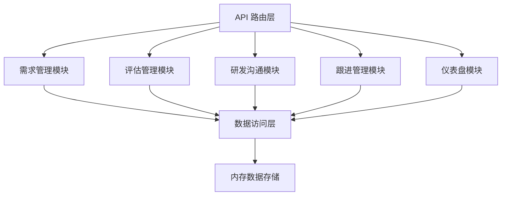
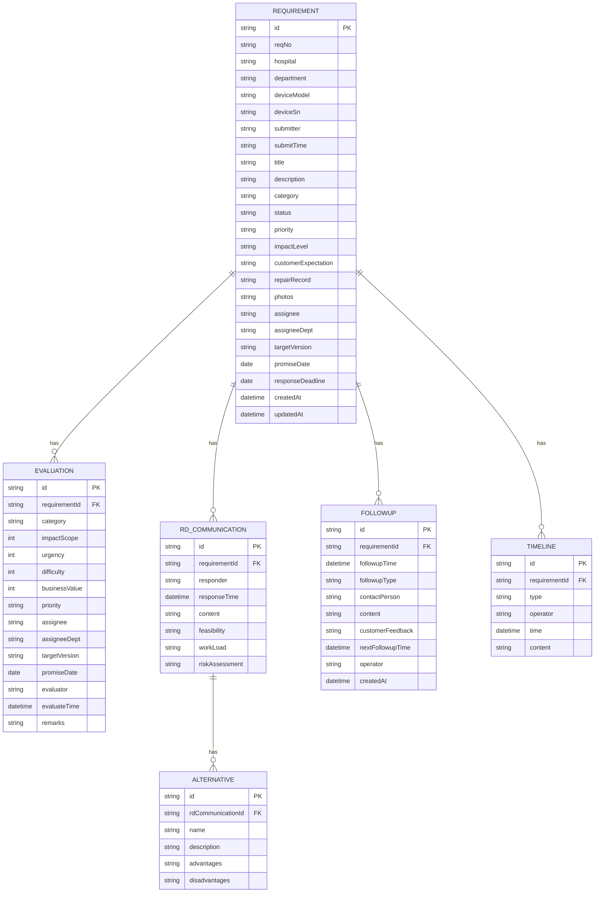

## 1. 架构设计



## 2. 技术描述

- 前端：React@18 + TypeScript + Vite@5
- 后端：Express@4 + TypeScript
- 数据库：内存数据存储（使用 Mock 数据，便于演示）
- 状态管理：Zustand
- 路由：React Router DOM@6
- 样式：TailwindCSS@3
- 图表：Recharts
- 图标：Lucide React
- HTTP 客户端：Axios
- 开发工具：Vite, TypeScript, ESLint

## 3. 路由定义

| 路由 | 页面 | 说明 |
|------|------|------|
| /dashboard | 汇总仪表盘 | 首页，数据概览、高频设备、预警提醒 |
| /requirements | 客户需求台账 | 需求列表、筛选、新建 |
| /requirements/:id | 需求详情 | 需求完整信息 |
| /requirements/:id/evaluation | 优先级评估 | 分类、评分、分配 |
| /requirements/:id/rd | 研发沟通 | 研发答复、可行性分析 |
| /requirements/:id/followup | 客户跟进 | 回访、沟通记录 |

## 4. API 定义

### 4.1 数据类型定义

```typescript
// 需求状态
type RequirementStatus = 'pending' | 'evaluating' | 'processing' | 'followup' | 'closed';

// 需求分类
type RequirementCategory = 'fault' | 'experience' | 'compliance' | 'training';

// 优先级
type Priority = 'critical' | 'high' | 'medium' | 'low';

// 影响程度
type ImpactLevel = 'severe' | 'significant' | 'moderate' | 'minor';

// 需求基础信息
interface Requirement {
  id: string;
  reqNo: string;
  hospital: string;
  department: string;
  deviceModel: string;
  deviceSn: string;
  submitter: string;
  submitTime: string;
  title: string;
  description: string;
  category: RequirementCategory | null;
  status: RequirementStatus;
  priority: Priority | null;
  impactLevel: ImpactLevel;
  customerExpectation: string;
  repairRecord: string;
  photos: string[];
  assignee: string | null;
  assigneeDept: string | null;
  targetVersion: string | null;
  promiseDate: string | null;
  responseDeadline: string;
  createdAt: string;
  updatedAt: string;
}

// 评估记录
interface Evaluation {
  id: string;
  requirementId: string;
  category: RequirementCategory;
  impactScope: number; // 1-5
  urgency: number; // 1-5
  difficulty: number; // 1-5
  businessValue: number; // 1-5
  priority: Priority;
  assignee: string;
  assigneeDept: string;
  targetVersion: string;
  promiseDate: string;
  evaluator: string;
  evaluateTime: string;
  remarks: string;
}

// 研发沟通记录
interface RdCommunication {
  id: string;
  requirementId: string;
  responder: string;
  responseTime: string;
  content: string;
  feasibility: 'feasible' | 'conditional' | 'not-feasible' | 'pending';
  workLoad: string;
  riskAssessment: string;
  alternatives: Alternative[];
}

// 替代方案
interface Alternative {
  id: string;
  name: string;
  description: string;
  advantages: string;
  disadvantages: string;
}

// 客户跟进记录
interface Followup {
  id: string;
  requirementId: string;
  followupTime: string;
  followupType: 'phone' | 'onsite' | 'email';
  contactPerson: string;
  content: string;
  customerFeedback: string;
  nextFollowupTime: string | null;
  operator: string;
  createdAt: string;
}

// 时间线记录
interface Timeline {
  id: string;
  requirementId: string;
  type: 'create' | 'evaluate' | 'rd-reply' | 'followup' | 'status-change';
  operator: string;
  time: string;
  content: string;
}
```

### 4.2 接口列表

| 方法 | 路径 | 说明 |
|------|------|------|
| GET | /api/requirements | 获取需求列表 |
| GET | /api/requirements/:id | 获取需求详情 |
| POST | /api/requirements | 新建需求 |
| PUT | /api/requirements/:id | 更新需求 |
| GET | /api/requirements/:id/evaluation | 获取评估信息 |
| POST | /api/requirements/:id/evaluation | 提交评估 |
| GET | /api/requirements/:id/rd | 获取研发沟通记录 |
| POST | /api/requirements/:id/rd | 添加研发沟通 |
| GET | /api/requirements/:id/followup | 获取跟进记录 |
| POST | /api/requirements/:id/followup | 添加跟进记录 |
| GET | /api/requirements/:id/timeline | 获取时间线 |
| GET | /api/dashboard/stats | 获取仪表盘统计 |
| GET | /api/dashboard/top-devices | 获取高频设备数据 |
| GET | /api/dashboard/pending | 获取未响应需求 |
| GET | /api/dashboard/deadlines | 获取到期事项 |
| GET | /api/hospitals | 获取医院列表 |
| GET | /api/departments | 获取科室列表 |
| GET | /api/devices | 获取设备型号列表 |
| GET | /api/users | 获取用户列表 |

## 5. 服务器架构



## 6. 数据模型

### 6.1 ER 图



### 6.2 前端项目结构

```
src/
├── components/          # 公共组件
│   ├── Layout/       # 布局组件
│   ├── StatusBadge.tsx
│   ├── PriorityBadge.tsx
│   ├── RequirementCard.tsx
│   └── Timeline.tsx
├── pages/             # 页面组件
│   ├── Dashboard.tsx
│   ├── RequirementList.tsx
│   ├── RequirementDetail.tsx
│   ├── Evaluation.tsx
│   ├── RdCommunication.tsx
│   └── CustomerFollowup.tsx
├── store/             # 状态管理
│   └── useStore.ts
├── api/               # API 调用
│   └── index.ts
├── types/             # 类型定义
│   └── index.ts
├── utils/             # 工具函数
│   └── index.ts
├── App.tsx
├── main.tsx
└── index.css

api/                   # 后端代码
├── routes/           # 路由
│   ├── requirements.ts
│   ├── evaluation.ts
│   ├── rd.ts
│   ├── followup.ts
│   └── dashboard.ts
├── data/            # Mock 数据
│   └── mockData.ts
├── types/           # 共享类型
│   └── index.ts
└── server.ts        # 服务器入口
```
